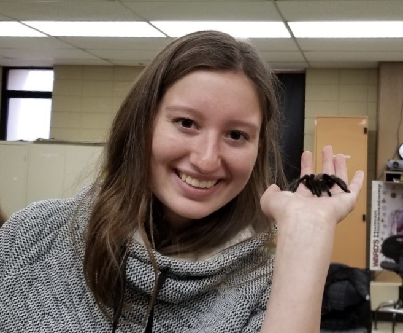

## about me

Hello!

I am graduate student at the Columbia Mailman School of Public Health, working on my Master of Public Health degree in Epidemiology. My primary research interests include zoonotic and vector-borne diseases and wildlife disease ecology.  

